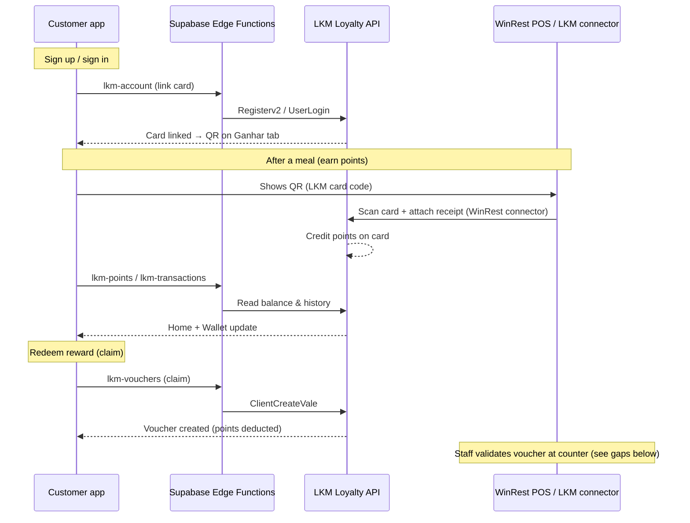

# Restaurant POS testing & go-live checklist

**App:** Chef Domingos loyalty (Expo + Supabase + LKM)  
**Audience:** Product owner, dev team, restaurant staff, LKM / POS support  
**Last updated:** June 2026

---

## 1. How it works today (high level)



**Important:** Point **earning** at the till is handled by **LKM + POS** (WinRest connector), not by scanning a receipt inside the customer app. The customer app shows a **loyalty card QR** (`COD_CARTAO` from LKM). Staff scan that code on the POS after payment.

**QR content:** plain LKM card id (same value as shown under the QR). Fallback: short code (e.g. `A3B2-C4D5-E6F7`) with **Copy code** on the Ganhar screen.

---

## 2. Before you go to the restaurant

### 2.1 Confirm with LKM / POS provider

Ask LKM (or whoever manages WinRest integration) to confirm:

| Item | Why |
|------|-----|
| Store is active in LKM for **Chef Domingos** (Mar Shopping Loulé) | Inactive store → “cartão ainda não está ativo” |
| **`LKM_STORE_EXTERNAL_ID`** in our config matches their store id | Wrong id → auth / registration failures |
| **`LKM_GRUPO_DESCONTO`** (currently `5156`) is correct for this brand | Wrong group → Registerv2 fails |
| WinRest connector is **live** for that store | Without it, POS scan won’t credit points |
| POS scanner reads **customer card QR** (LKM card code format) | Confirms same payload as Ganhar screen |
| Which **receipt / transaction id** format they use if you test `lkm-scan` manually | Talão number vs internal id |
| **Pré-produção vs produção** URL for the test day | PP: `https://api-loyalty-pp.mymobile.pt` — Prod: `https://api-loyalty.myclient.pt` |
| Reward **catalog** is configured in LKM for this store | Empty catalog → fallback offers in app only |

### 2.2 Backend (Supabase) — verify once

- [ ] All 5 edge functions deployed and **ACTIVE**: `lkm-account`, `lkm-points`, `lkm-transactions`, `lkm-vouchers`, `lkm-scan`
- [ ] `lkm_runtime_config` table populated (or secrets set): `LKM_BASE_URL`, `LKM_TOKEN_APP`, `LKM_HMAC_SECRET`, `LKM_STORE_EXTERNAL_ID`, `LKM_GRUPO_DESCONTO`
- [ ] Migrations applied: `002_loyalty.sql`, `003_user_preferences.sql`, `004_lkm_runtime_config.sql`
- [ ] `lkm_token_cache` not holding old malformed tokens (clear `app_token` row if JWT errors reappear)
- [ ] Edge functions use `verify_jwt: false` (app sends Supabase session JWT; functions validate manually)

### 2.3 App build for the test

- [ ] `.env.local` has valid `EXPO_PUBLIC_SUPABASE_URL` and `EXPO_PUBLIC_SUPABASE_ANON_KEY`
- [ ] `USE_MOCK = false` in `src/lib/config.ts`
- [ ] Test device has **mobile data or restaurant Wi‑Fi** (not only Expo dev LAN if using a release build)
- [ ] Install on **real phone** (QR brightness, camera, network closer to production)

### 2.4 Test accounts

Prepare **at least 2 accounts**:

1. **Fresh account** — register at restaurant (or before) to test full LKM linking + QR.
2. **Existing account** — already linked, 0 points, to test earn flow only.

Write down email + password; you need password once for LKM link on first login (stored briefly in SecureStore for retry).

---

## 3. What to test at the restaurant (with POS)

Use this as a printed checklist. For each step: **Pass / Fail / Notes**.

### A. Registration & card linking

| # | Action | Expected result |
|---|--------|-----------------|
| A1 | Install app → register with **new email** | Account created, no crash |
| A2 | Open **Ganhar** tab | QR visible + card code / short code (not “cartão ainda não está ativo”) |
| A3 | Open **Home** | Points show **0** (not blank / NaN / error) |
| A4 | Open **Wallet** | Empty history or “no transactions”, no error banner |
| A5 | Sign out → sign in again | QR still works without re-registering |
| A6 | Kill app → reopen (still logged in) | QR still works (SecureStore retry path) |

### B. Earn points (main POS test)

| # | Action | Expected result |
|---|--------|-----------------|
| B1 | Place a **real test order** and pay at POS | Receipt printed |
| B2 | Open **Ganhar** → show QR to staff | POS accepts scan (beep / card recognised) |
| B3 | If scan fails, staff enters **short code** manually (if POS supports it) | Same as B2 |
| B4 | Pull to refresh **Home** (or leave tab and return) | Balance **increases** (amount per LKM rules) |
| B5 | Open **Wallet** → filter **Ganhos** | New row: restaurant name, date, **+X pontos** |
| B6 | Repeat B1–B2 with **same receipt** (if POS allows) | **No** second credit; POS or LKM should reject duplicate |
| B7 | Second purchase same day | Points add again; balance = sum of both |

**If B2 fails:** problem is almost always **LKM store / WinRest connector / scanner config**, not the QR image itself. Compare scanned value with card code under QR (must match exactly).

### C. Rewards catalog & claim

| # | Action | Expected result |
|---|--------|-----------------|
| C1 | Open **Recompensas** | Milestone bar renders; exclusive offers list loads |
| C2 | Tap claim on an offer **without enough points** | Alert: insufficient points |
| C3 | After enough points (or LKM test catalog with low cost), **claim** an offer | Success alert; points decrease on Home |
| C4 | Check LKM backoffice (if access) | Voucher exists for user |

**Gap:** App has **no “My vouchers” screen** yet. After claim, customer cannot show a voucher QR in-app. Staff validation UI (**Modo Staff**) is also **not built**. For MVP redemption test, coordinate with LKM on how staff redeem on POS today.

### D. Edge cases (if time allows)

| # | Action | Expected result |
|---|--------|-----------------|
| D1 | Airplane mode → open Ganhar | QR still shows (card already linked) |
| D2 | Airplane mode → open Home / Wallet | Graceful error or cached 0; no crash |
| D3 | Switch app language (Profile / settings) | Ganhar, Wallet, Recompensas strings update |
| D4 | Test at **second restaurant** in group (if multiple store ids) | Confirm which store id POS uses per venue |

---

## 4. What to record during the test

For each failed step, capture:

- Time, restaurant name, POS terminal id  
- Test account email  
- **Exact card code** from Ganhar (not password)  
- Receipt / talão number  
- Screenshot of app + photo of POS message  
- Supabase edge function logs (`lkm-account`, `lkm-points`, `lkm-transactions`)  
- LKM support ticket reference if escalated  

---

## 5. What is ready vs not ready

### Ready (customer app + backend)

| Feature | Status |
|---------|--------|
| Email register / login | ✅ |
| LKM card auto-link on signup/login | ✅ |
| Ganhar QR + copy short code | ✅ |
| Points balance (Home) | ✅ |
| Transaction history (Wallet) | ✅ |
| Rewards catalog + claim | ✅ |
| **My vouchers** screen with QR | ✅ |
| **Modo Staff** (long-press logo → PIN → validate voucher) | ✅ |
| Milestone progress bar | ✅ |
| PT / EN i18n (main tabs) | ✅ |
| Supabase edge functions → LKM API | ✅ |
| EAS build config (`eas.json`) | ✅ (run `eas init` to link project) |

### Not ready / missing for full MVP spec

| Feature | Status | Impact at restaurant |
|---------|--------|----------------------|
| **Camera barcode scanner** in Staff mode | ❌ Manual code entry only | Staff types voucher code from customer QR |
| **WinRest adapter** in our backend | ❌ Stub only | Earn flow depends 100% on LKM/POS connector |
| Receipt scan **inside customer app** | ❌ Not implemented | By design — POS scans customer card |
| Phone OTP / Google sign-in | ❌ Not in current flows | Email only |
| Push notifications (PANS cross-promo) | ❌ Not implemented | Journey D in PRD |
| Share-for-points anti-fraud | ❌ Not implemented | Journey E in PRD |
| Production app store build submitted | ⚠️ Config ready; run `eas build` | Dev/Expo until build is produced |

---

## 6. Changes required before public launch

### 6.1 LKM & restaurant (non-code)

1. Move from **pré-produção** to **production** LKM API when LKM signs off on tests.  
2. Set production values in `lkm_runtime_config` / Supabase secrets.  
3. Confirm **each restaurant** `CodLoja` if Portuguese Lab vs Pizza Lab use different store ids.  
4. Configure real **reward catalog** and point rules in LKM.  
5. Train staff: after payment → scan customer QR on Ganhar → confirm points if customer asks.  
6. Document manual POS step for **voucher discount** until Staff mode exists.

### 6.2 Backend

1. Keep edge functions deployed after any code change (`npm run lkm:deploy`).  
2. Monitor logs first week: JWT 600, empty `COD_CARTAO`, duplicate transaction 409.  
3. Align `restaurants.lkm_store_id` in DB with real LKM ids (migration seed is placeholder).  
4. Optional: rotate / clear `lkm_token_cache` after credential changes.

### 6.3 App — must-have before customers use it

| Priority | Task |
|----------|------|
| P0 | **Modo Staff**: long-press logo on Conta → PIN → validate voucher (`validateStaff` edge action) | ✅ Done |
| P0 | **My vouchers** screen: list active vouchers + QR per voucher | ✅ Done |
| P0 | **Production build**: run `npx eas-cli init` then `eas build --profile preview` | ⚠️ Config added; run EAS |
| P0 | Update `app.json`: name, slug, bundle ids | ✅ Done |
| P1 | Remove dependency on storing password in SecureStore once LKM offers token-only relink |
| P1 | Show user-visible error when points/transactions fail (not silent 0) |
| P1 | Legal: real Terms & Privacy URLs in Profile (currently static screens) |
| P2 | Phone login, push notifications, PANS campaigns |

### 6.4 Environment checklist

**Client (`.env.local` / EAS secrets):**

```env
EXPO_PUBLIC_SUPABASE_URL=https://<project>.supabase.co
EXPO_PUBLIC_SUPABASE_ANON_KEY=<anon-key>
EXPO_PUBLIC_STAFF_PIN=1234
```

**Server (Supabase secrets or `lkm_runtime_config`):**

```env
LKM_BASE_URL=https://api-loyalty.myclient.pt   # production when ready
LKM_TOKEN_APP=<from LKM>
LKM_HMAC_SECRET=<PartnerKey from LKM>
LKM_STORE_EXTERNAL_ID=<store id for this venue>
LKM_GRUPO_DESCONTO=5156                         # confirm with LKM
```

---

## 7. Quick troubleshooting

| Symptom | Likely cause | What to do |
|---------|--------------|------------|
| “Cartão ainda não está ativo” / no QR | Card not linked in LKM or store inactive | Sign out/in; check `users.lkm_card_code` in Supabase; confirm store with LKM |
| QR shows but POS doesn’t recognise | Scanner config / wrong code type | Verify POS expects LKM card id; compare scanned string with app code |
| Points stay 0 after purchase | WinRest connector or wrong store | Escalate to LKM with receipt id + card code |
| Wallet error in console | Edge function or token issue | Redeploy functions; clear `lkm_token_cache` |
| Balance shows NaN | API returned non-numeric (should be fixed) | Pull latest app; report if still happens |
| Claim works but nowhere to show voucher | Missing UI | Use LKM backoffice until My vouchers ships |
| Duplicate points on same receipt | Connector not deduplicating | Expected to block; report if duplicate credits |

---

## 8. Suggested test day agenda (~45 min)

1. **5 min** — Backend smoke test: new login, QR visible, 0 points.  
2. **15 min** — One real purchase + POS scan + refresh Home/Wallet.  
3. **10 min** — Second purchase or duplicate receipt test.  
4. **10 min** — Claim cheapest catalog item (if points allow).  
5. **5 min** — Sign-off with LKM contact: store id, connector logs, open issues.

---

## 9. Sign-off criteria (ready for real customers)

Treat launch as approved only when **all** are true:

- [ ] New user → QR active within 1 minute of registration  
- [ ] POS scan after payment credits points within 2 minutes (refresh app)  
- [ ] Duplicate receipt does not double-credit  
- [ ] Wallet history matches LKM backoffice  
- [ ] Claim deducts points and creates voucher in LKM  
- [ ] Staff can redeem voucher (via POS or Staff mode app — document which)  
- [ ] Production LKM + Supabase credentials configured  
- [ ] App installed from TestFlight / Play internal testing (not Expo Go only)  
- [ ] Staff one-page instruction printed (scan Ganhar QR after payment)

---

## 10. Contacts & references

| Resource | Location |
|----------|----------|
| LKM API Postman collection | `LKM API Customers.postman_collection.json` |
| Product spec (PRD) | `Markdown APP Chefe.md` |
| Edge function deploy | `npm run lkm:deploy` |
| Loyalty QR payload | `src/lib/loyaltyQr.ts` — raw `lkm_card_code` |
| Supabase project ref | `wrawujclqgxdnbddwokv` (from package.json scripts) |

**Escalation order for POS issues:** Restaurant manager → LKM support → Dev team (Supabase logs + card code + receipt id).
